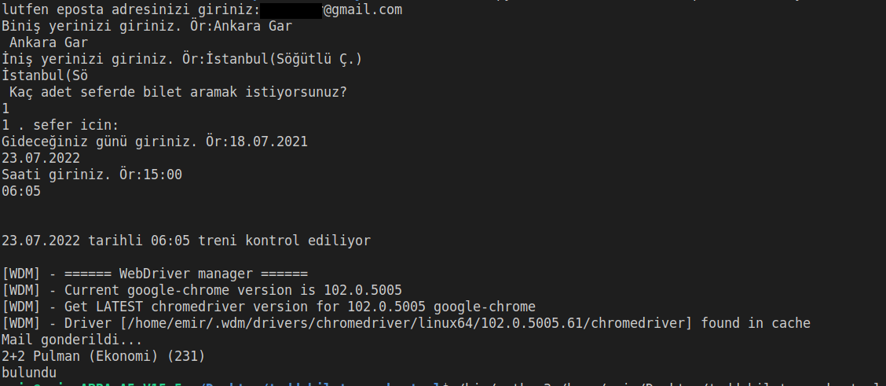
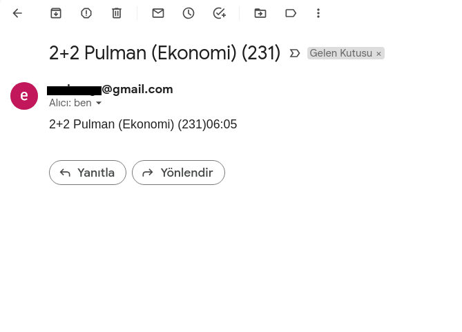

# TCDD Bilet Kontrol


## Kod Eğitim amaçlı geliştirilmiştir...


### Paket Kurulumu

`$ pip install -r requirements.txt`

- Chrome driver indirme https://chromedriver.storage.googleapis.com/index.html?path=79.0.3945.36/
- chromedriver Linux makinemde /usr/local/bin/ altındadır
- Mail ayarları için Mail.py dosyasındaki mail ayarlarınızı girmeyi unutmayınız...
- Mail göndermede problem yaşıyorsanız ISS ayarlarınız smtp'yi engelliyor olabilir. Servis sağlayıcınızla iletişime geçiniz.

Uygulama TCDD sitesine özel tasarlanmıştır.

Sizin uygulamayı çalıştırırken vereceğiniz argumentler doğrultusunda çalışmaktadır. 5dk aralıklarla verdiğiniz güzergah üzerinde ilgili saatteki seferi kontrol eder.

```sh
$ python3 main.py 
```

### Örnek Kullanım




